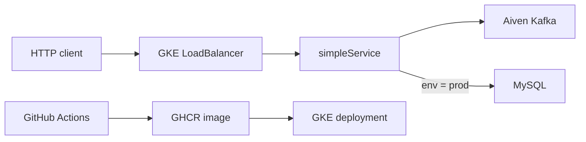

# simpleService

`simpleService` is a deployed Go HTTP service automatically implemented by
[NL2TRPCService](https://github.com/qw33ha/NL2TRPCService) on the public
[tRPC-Go](https://github.com/trpc-group/trpc-go) ecosystem. It accepts JSON events,
publishes them to Kafka, and conditionally persists user data to MySQL.

Starting from a natural-language service description, NL2TRPCService handled the complete
delivery workflow: requirement clarification, source generation, local verification, Git
publication, container packaging, and deployment to Google Kubernetes Engine through GitHub
Actions.

> This repository is the generated result. Its service implementation and delivery assets were
> produced automatically by NL2TRPCService rather than assembled as a handwritten demo.

## One-time platform preparation

NL2TRPCService automates the application lifecycle, while the target platform must first be
prepared with the infrastructure and permissions it is allowed to use:

- A reachable Kubernetes cluster and deployment namespace.
- A cloud service account authorized to obtain cluster credentials and manage namespaced
  workloads and Services.
- GitHub-to-cloud authentication, preferably using short-lived workload identity federation
  instead of a stored service-account key.
- Repository variables describing the cloud project, cluster, region, and deployment platform.
- Permission for GitHub Actions to publish container images and deploy the generated manifests.
- Kubernetes Secrets containing runtime Kafka and database credentials.
- Network access from the Kubernetes workload to Kafka and MySQL.
- Existing Kafka topics and database tables required by the requested service behavior.

These are environment-level prerequisites rather than generated application code. Once they are
available, NL2TRPCService collects their non-secret identifiers during the conversation, generates
the matching manifests and workflow, and runs the build-and-deploy loop automatically. Secret
values remain in GitHub or Kubernetes secret storage.

## What it does

- Exposes a public JSON API through a GKE `LoadBalancer`.
- Publishes accepted request bodies to the Kafka topic `test-topic`.
- Uses the request's `user` value as the Kafka message key when present.
- When `env` is `prod`, inserts `user` and `email` into the predefined MySQL `users` table.
- Provides a Kubernetes-compatible health endpoint at `/is_healthy`.

## Architecture



Kafka and MySQL credentials are injected from Kubernetes Secrets; they are not stored in the
source code or container image.

## API

### Health check

```bash
export SERVICE_URL="https://your-service.example.com"
curl -i "$SERVICE_URL/is_healthy"
```

Expected body:

```json
{"status":"ok"}
```

### Publish an event

```bash
curl -i -X POST "$SERVICE_URL/" \
  -H 'Content-Type: application/json' \
  -d '{
    "env": "staging",
    "user": "readme-demo",
    "email": "readme-demo@example.com",
    "message": "Hello from the deployed simpleService"
  }'
```

Successful requests return `202 Accepted`:

```json
{"message":"processed"}
```

With `env: "staging"`, the event is published to Kafka only. Change it to `prod` to also
write the `user` and `email` values to MySQL.


## Delivery

After generating and verifying the service locally, NL2TRPCService publishes the revision and
monitors the automated delivery workflow. Every generated revision passes three GitHub Actions
jobs:

1. **build** — verifies and compiles the Go service.
2. **docker** — builds the image and publishes it to GitHub Container Registry.
3. **deploy** — authenticates with Google Cloud and applies the Kubernetes manifests.


## Configuration

Runtime configuration is read from environment variables and Kubernetes Secrets. See
[`.env.example`](.env.example) for the expected local variables.

The deployed service expects Kubernetes Secrets containing Kafka SASL credentials and the
MySQL username and password.

The Kafka CA certificate is mounted from the project-provided `ca.pem`. Provider credentials,
private keys, kubeconfig files, and secret values must never be committed.

## Run locally

Create a local environment file, provide reachable Kafka and MySQL services, then run:

```bash
cp .env.example .env
go mod tidy
go run .
```

The HTTP server listens on port `8080` by default:

```bash
curl http://localhost:8080/is_healthy
```

## Project layout

```text
handler/             HTTP, Kafka, and MySQL integration code
k8s/                 Deployment and Service manifests
.github/workflows/   Build, container publishing, and GKE deployment
Dockerfile           Production container image
trpc_go.yaml         tRPC-Go runtime configuration
```

## Built with

- [tRPC-Go](https://github.com/trpc-group/trpc-go)
- [go-database](https://github.com/trpc-ecosystem/go-database)
- [Shopify Sarama](https://github.com/Shopify/sarama)
- Google Kubernetes Engine
- GitHub Actions and GitHub Container Registry
